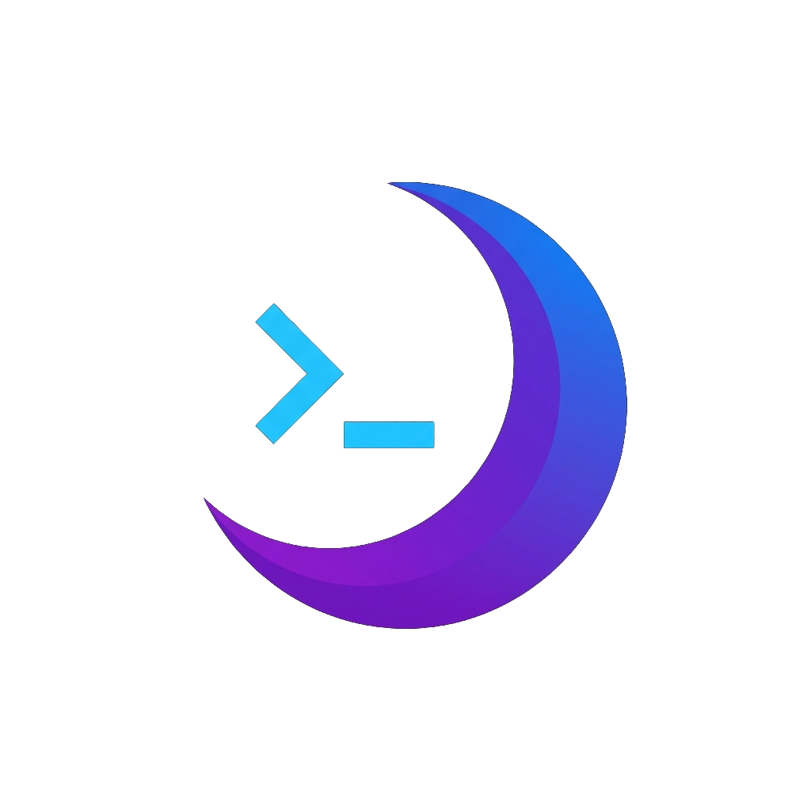

#  Lunar

**A modern SSH terminal, SFTP file manager, and S3-compatible object storage browser — all in one.**

Lunar is a high-performance, cross-platform desktop application designed to streamline your remote workflows. Browse SSH/SFTP servers and S3-compatible object stores side-by-side in the same dual-pane file manager, with a powerful terminal a tab away.

---

## ✨ Key Features

### 💻 Advanced SSH Terminal

- **High Performance**: Powered by **xterm.js** with **WebGL rendering** for buttery-smooth scrolling and zero-lag input.
- **Multi-Session Management**: Organize your work with tabs and multi-pane splits (horizontal/vertical).
- **Professional Theming**: Built-in themes including Dracula, Nord, Tokyo Night, Gruvbox, and Monokai.
- **Unicode 11 Support**: Robust character rendering for modern CLI tools and emojis.
- **Resilient Connectivity**: Automatic reconnection with exponential backoff and configurable retry limits.

### 📁 Integrated SFTP Browser

- **Dual-Pane Workflow**: Effortlessly transfer files between local and remote systems.
- **Drag & Drop**: Seamlessly move files into the cloud or down to your machine.
- **Queue Management**: Concurrent transfer engine with real-time progress monitoring.
- **In-App Preview**: Securely preview configuration files without leaving the application.

### ☁️ S3-Compatible Object Storage

- **First-Class Provider**: AWS S3 and any S3-compatible service (MinIO, Cloudflare R2, Backblaze B2, Wasabi) sit alongside SFTP.
- **Multipart Uploads**: Large files stream through `@aws-sdk/lib-storage` with live progress and abort support.
- **Bucket-Aware Navigation**: Connections can pin a default bucket or browse the whole account from the virtual root.
- **S3 Operation Timeouts**: Optimized storage engine ensuring a responsive experience even on slow networks.

### 🛠️ Developer-First Tools

- **Command Palette**: Access every action instantly with `Cmd+K` (macOS) or `Ctrl+K` (Linux/Windows).
- **Connection Manager**: Securely store SSH/SFTP and S3 connections side-by-side. Organize via folders and tags.
- **Customizable Sidebar**: Reorderable connection sections with persistent drag-and-drop state.
- **Auto-Update**: Stay current with integrated GitHub-based updates and interactive notifications.

---

## 🏗️ Architecture & Security

Lunar has undergone a rigorous architectural audit to ensure the highest standards of safety and performance:

- **Type-Safe IPC Bridge**: The renderer process communicates with the main process through a strictly typed IPC bridge, eliminating "any" casts and ensuring compile-time safety across process boundaries.
- **Pluggable Storage Providers**: A unified `StorageProvider` abstraction with a session-keyed registry routes the transfer queue and `storage:*` IPC channels to the right backend (SFTP or S3).
- **Sandboxed Execution**: Renderer processes are fully sandboxed with no direct access to the filesystem or network.
- **Input Validation**: All IPC arguments undergo strict validation, including path traversal guards and settings whitelisting.
- **Zero Circular Dependencies**: A clean, modular architecture ensures long-term maintainability.
- **Credential Protection**: SSH passwords/passphrases and S3 access keys are encrypted using **AES-256-GCM** — never stored in plain text.

---

## 🚀 Getting Started

### Prerequisites

- [Node.js](https://nodejs.org/) (v22 or higher)
- [npm](https://www.npmjs.com/)

### Installation

```bash
# Clone the repository
git clone https://github.com/salvatorecorvaglia/lunar.git
cd lunar

# Install dependencies
npm install
```

### Development

```bash
# Start the application with HMR
npm run dev
```

---

## 🧪 Quality & Testing

Lunar maintains a high bar for code quality with comprehensive testing and automated formatting:

```bash
npm test               # Execute Vitest suite
npm run test:watch     # Run tests in watch mode
npm run test:coverage  # Run tests with coverage report
npm run typecheck      # Run TypeScript compiler checks
npm run lint           # Static analysis with ESLint
npm run format         # Format code with Prettier
```

---

## 🤝 Contributing

Contributions are welcome! Please see [CONTRIBUTING.md](CONTRIBUTING.md) for guidelines.

## 🔐 Security

If you discover a security vulnerability, please see our [Security Policy](SECURITY.md).

## 📝 License

Distributed under the MIT License. See [LICENSE](LICENSE) for more information.

---

**Author**: [Salvatore Corvaglia](https://github.com/salvatorecorvaglia)
